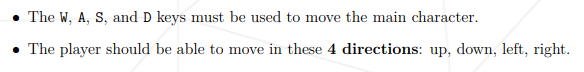
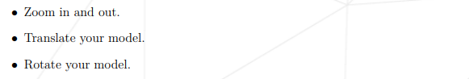
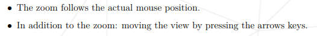
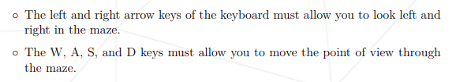
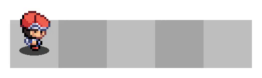
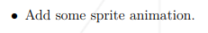
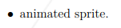

# Preface

The common core currently features 5 projects said to be graphical:
- so_long
- FdF
- fract-ol
- cub3D
- miniRT

This proposal aims to add either `clock` or `gettimeofday` to the list of allowed functions for the mandatory part of these projects.

# 1. Introduction

Let's go back a bit to the list of allowed functions and take a look at the minilibx.

The minilibx is a minimalist C library provided by 42 in order to make graphic programming accessible to beginners. It features window creation, image decoding and simple input handling. The code is architectured around a game loop in mlx_loop, which repeatedly calls "hooks" defined by the programmer.

This sort of game loop is standard practice in other graphic libraries. I had the chance to use the SDL, glfw, pygame and html canvas for making games and applications, and the core concept is always the same.

However, the documentation of each of these libraries also include time handling in the game loop.

Certainly, when all you want is to draw to the screen, getting the current time isn't necessary. And hundreds of students have validated the previously mentionned projects during the last few years, which shows that time handling itself isn't necessary for their completion.

However when designing games or graphical applications, measuring time is actually important. Notably, time affects animations, movement and framerate. It comes off as no surprise that time handling is mentionned early in those other graphical libraries.

# 2. Current issues

## 2.1. Movement

Movements are part of the requirements for so_long, FdF, fract-ol, and cub3D - with miniRT being the only one left out.

| Project  | Requirement                                                                                                       |
|----------|-------------------------------------------------------------------------------------------------------------------|
| so_long  |                                              |
| FdF      |                                          |
| fract-ol |  |
| cub3D    |                         |

There are two ways to code movement:
- Jagged movement, with step by step teleportation


- Smooth movement, with either time measurement or a frame counter (we will talk about that later).


Admittedly, movement doesn't have to be smooth. Jagged movement doesn't need time measurements - <b>at the cost of being very unpractical for the user</b>. Jagged movement is as far as I've seen the prefered solution for so-long, FdF and fract-ol, as it is easier to code, and time measurement isn't available anyways.

However Cub3D is a first person game, and so users expect to have smooth movement. Jagged movement for this project is especially awkard and unfitting.

## 2.2 Animations

As previously mentionned, animations also rely on time measurements. They are part of the requirement of the subjects of both so-long and cub3D:

| Project | Requirement                                                                               |
|---------|-------------------------------------------------------------------------------------------|
| so_long |  |
| cub3D   |                |


Probably due to the absence of time measurement functions, a lot of students are lost as to how they should implement animations. I often browse discord and discuss subjects with other students there.

There are the two common workarounds to compensate for the lack of time measurement. You'll notice that they mirror the techniques used for movement aswell.
- Tying animations to user input
- Tying animation to a frame counter

Input-based animations implies that every time the user presses a key or interacts with the mouse, a frame goes by. And reciprocly, when the user isn't doing anything, the whole game is frozen.

This can hardly be called animations, as the images don't change on their own. It requires bending definitions a bit, and it is only considered a solution because subjects have unclear/soft requirements.
Certainly, this solution isn't ideal, and it is only a patch made to compensate the lack of time measurement.

## 2.3 Frame counters

As mentionned earlier, one way to replace time measurement is to use a counter that increments with each frame. This technique was used in the early days of video games for measuring time. However it relies on the consistency of the framerate, and on the speed of execution.
### 2.3.1. Framerate consistency

For time to appear linear when using a frame counter, obviously the time each frame takes to render has to be consistent.

In the afore-mentioned projects, some viewpoints take more computations to render than others. A zoomed out scene with a big map in FdF, a very zoomed in fractal in fract-ol, a camera looking towards a lot of objects in miniRT, all of these take time to compute.

And so movement or animations based on the frame counter would slow down considerably in these situations, while they would stay consistent if they were based on real time instead.
### 2.3.2. Speed of execution

The speed of execution, while it sounds similar to the previous category, is a separate matter. The frame counter will be incremented way faster on a faster PC. Or way slower under valgrind, or a VM.

This is especially noticeable at 42 Paris where we have have 2 distincts PC models at our disposition: very performant Dells, and Macs that begin to show their age. The performance difference isn't really a problem in day to day coding, but when using frame-counter-based movement or  animations, it is immediatly noticeable.

The same graphical program will perform drastically different on the two models, and so it's not unusual for students to only run their program on one model. Another common solution is to have a \#define in the project that serves as a scale for time, and that needs to be changed manually when testing on another model or with Valgrind.

Having code depend on the platform is clumsy, and the technique of using a frame counter is, as previously demonstrated, unpractical.
The needed independance between real time and execution speed is the reason other libraries measure real time in their main loop.

In the end, frame counters are just a patch to compensate for what really lacks: real time measurement.

## 2.4. Concerning bonuses

Out of the five graphical projects, four allow users to add other functions in their bonuses: so_long, FdF (english subject only), cub3D and miniRT. And so it is possible to use clock and gettimeofday for the bonuses - except for fract-ol.

What I have been advocating for all this time is that real time measurement shouldn't be bonus-only. Time plays a big role in graphical applications.

Students that want to do well, and use smooth movement and animations in their projects are forced to use unpractical workarounds for the mandatory part.

From an educational standpoint, I don't think it is a right idea to force these bad practices.

# 3. Proposed solution

The solution this proposal brings, is to ask for the addition of `clock` or `gettimeofday` in the list of allowed functions in the mandatory part of each graphical project.

## 3.1. Adding clock

`clock` (see man 3 clock) is part of the Standard C library. It is declared in time.h.
`clock` permits precise time measurement, with generally microsecond precision.

Here's an example usage:
```C
double time_now;
double elapsed_time;

time_now = (double) clock() / CLOCKS_PER_SEC; // current time in seconds
elapsed_time = time_now - app->last_time; // difference with the last frame
player->x_pos += player->x_speed * elapsed_time; // the player moves smoothly, according to the difference
player->y_pos += player->y_speed * elapsed_time;
app->last_time = time_now;
```

The above example shows how to implement smooth movement based on real time measurement.

## 3.2. Adding gettimeofday

Other than `clock` there is another option, already present in Philosophers:

`gettimeofday` (see man 2 gettimeofday and man 3 gettimeofday) is part of the POSIX interface. It is declared in sys/time.h. It provides the date, as well as time measurement with microsecond precision. However the man warns that there may be discontinuities in time.

I've seen that in Philosophers, `gettimeofday` was prioritized over clock (which would be more appropriate). I considered that this choice might be due to factors out of my knowledge. Overall `gettimeofday` still works as intended, so it would be an acceptable alternative to `clock`.


# 4. Impact of changes

## 4.1 Compatibility with the current version

The current subjects are fully compatible with the proposed improvement as there will be no change to the requirements nor to the correction grid.

## 4.2 Improvements

Real time mesurement with clock will bring improvements on quite a few points.
### 4.2.1 Educational improvements

- Animations will finally adhere correctly to the requirements of so_long and cub3D.
- Adding real time measurement allows better practices than the ones currently in use. It might encourage to learn about time handling and interpolation.
- Smoother movements or framerate fixing also leads to a better user-experience, which is a + for evaluators.
### 4.2.2 Creativity improvements

- It will now be possible for students to code smooth movements in so_long, FdF, fract-ol and cub3D.
- Animated fractals will now become possible in fract-ol. Animated fractals are absolutely beautiful and it's a shame that the current subject prevents them. Because fract-ol is very framerate-inconsistent, the previously mentionned workarounds cannot apply.
- Measuring time makes it possible to stop heavy computations early, such as for fract-ol and miniRT. Most fract-ols currently show very noticeable lag spikes, of sometimes 10 seconds or more, when zooming, because of heavy computations. Measuring time and stopping calculations early would keep the program running smoothly.
- Animated menus, enemies and environement would lead to more expressive power.

A simple animated Mandelbrot fractal:


## 4.3 Downsides

There are no downsides as far as I'm aware of. Some students will probably ignore this added function, and that is fine.

# Final word

I think that adding time measurement to the mandatory part of graphical projects would bring the code closer to real-world practices, bring forth better code quality and enable students more creativity in their projects.